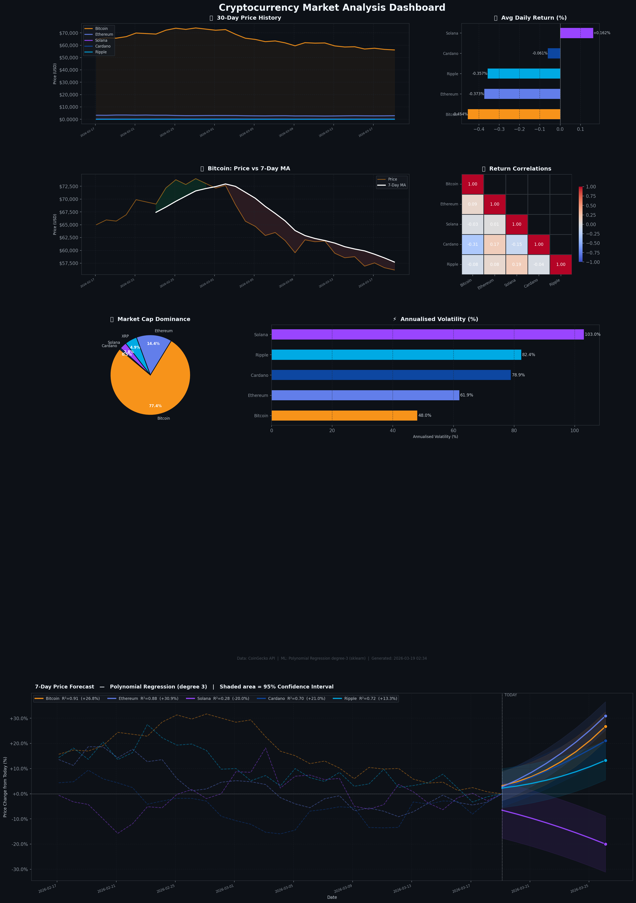

# CryptoScope — Cryptocurrency Market Analysis Dashboard

A data analysis dashboard that fetches live cryptocurrency market data, performs statistical analysis using Pandas, generates machine learning price forecasts, and visualises everything in a multi-panel Matplotlib dashboard.

Built as a university project demonstrating the full data engineering pipeline: **API → Pandas → ML → Visualisation**.

---

## Dashboard Preview



---

## Features

- **Live Data Fetching** — CoinGecko public API (no key required), with realistic GBM simulation fallback
- **Pandas Analysis** — descriptive stats, daily returns, rolling averages, cumulative returns, volatility, correlation
- **ML Price Forecast** — Polynomial Regression (degree 3) via scikit-learn with 7-day forecast and 95% confidence intervals
- **7-Panel Matplotlib Dashboard** — price history, daily returns, rolling MA, correlation heatmap, market dominance, volatility, and prediction chart

---

## Tech Stack

| Layer | Library |
|---|---|
| Data fetching | `requests` |
| Data analysis | `pandas`, `numpy` |
| Machine learning | `scikit-learn` |
| Visualisation | `matplotlib`, `seaborn` |

---

## Project Structure

```
crypto-analysis-dashboard/
│
├── crypto_dashboard.py      # Main script — runs the full pipeline
├── step_2_fetch_data.py     # Data fetching module
├── step_3_analysis.py       # Pandas analysis module
├── step_4_visualize.py      # Matplotlib visualisation module
└── requirements.txt         # Python dependencies
```

---

## Quick Start

```bash
# 1. Clone the repo
git clone https://github.com/wogerxx/crypto-analysis-dashboard.git
cd crypto-analysis-dashboard

# 2. Create and activate virtual environment
python3 -m venv venv
source venv/bin/activate        # Windows: venv\Scripts\activate

# 3. Install dependencies
pip install -r requirements.txt

# 4. Run — generates crypto_dashboard.png
python crypto_dashboard.py
```

---

## Data Pipeline

```
CoinGecko API
      │
      ▼
 fetch_historical()      30-day price data for 5 coins
 fetch_current()         Current price, market cap, volume
      │
      ▼
 analyse()               Pandas: returns, volatility, correlation
      │
      ▼
 predict()               sklearn: Polynomial Regression → 7-day forecast
      │
      ▼
 Matplotlib              7-panel dashboard saved as crypto_dashboard.png
```

---

## Analysis Performed

- **Descriptive statistics** — mean, std, min, max, coefficient of variation
- **Daily returns** — `pct_change()` across 30 days
- **7-day rolling average** — trend smoothing with above/below MA zones
- **Annualised volatility** — `std × √365`
- **Pearson correlation matrix** — which coins move together
- **Cumulative returns** — portfolio growth from period start
- **Market cap dominance** — each coin's share of total cap
- **ML forecast** — degree-3 polynomial regression, R² score, 95% confidence interval

---

## Coins Tracked

| Coin | Symbol |
|---|---|
| Bitcoin | BTC |
| Ethereum | ETH |
| Solana | SOL |
| Cardano | ADA |
| XRP | XRP |

---

## Requirements

```
requests>=2.31
pandas>=2.1
numpy>=1.26
scikit-learn>=1.3
matplotlib>=3.8
seaborn>=0.13
```

---

## Author

**wogerxx** — university project, 2025
